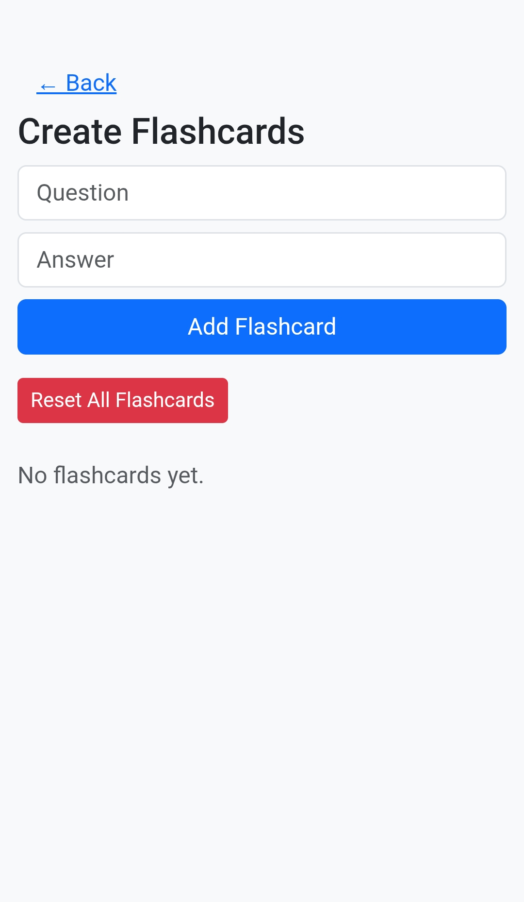
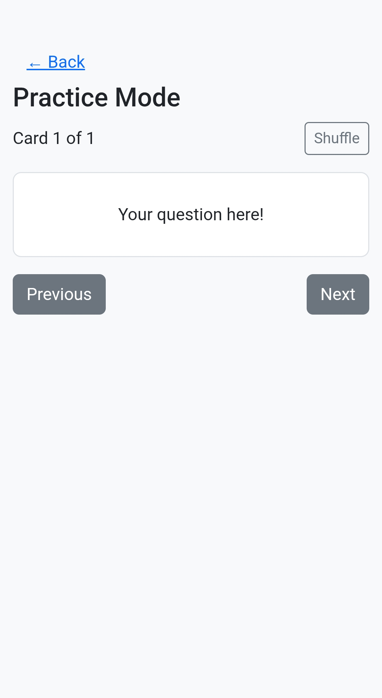

# Flashcard Web App

A simple, responsive flashcard-based educational web app built with HTML, CSS (Bootstrap), and Vanilla JavaScript. All flashcards are stored in your browser using localStorage—no backend required!

## 🚀 Features

- **Homepage**: Title, description, and navigation buttons
- **Create Flashcards**: Add, edit, delete, and flip flashcards; all changes saved in localStorage
- **Practice Mode**: Practice one card at a time, flip to reveal answer, navigate with Next/Previous, and shuffle cards
- **Persistent Storage**: All data is saved in your browser (localStorage)
- **Responsive UI**: Works on desktop and mobile, styled with Bootstrap and custom CSS
- **Reset Option**: Clear all flashcards with one click

## 🛠️ Technologies Used

- HTML5
- CSS3 & [Bootstrap 5](https://getbootstrap.com/)
- [Bootstrap Icons](https://icons.getbootstrap.com/) (for button icons)
- Vanilla JavaScript (no frameworks)

## 📦 File Structure

```
index.html      # Main HTML file
style.css       # Custom styles for flashcards and responsiveness
script.js       # All app logic (CRUD, navigation, rendering, localStorage)
README.md       # This file
```

## 🖥️ Setup & Usage

1. **Clone or Download** this repository.
2. Open `index.html` in your web browser.
3. Start creating and practicing with your own flashcards!

> **Note:** All your flashcards are saved in your browser. Clearing browser data or using a different browser/device will reset your cards.

## 📸 Screenshots





*(Replace the above URLs with your own screenshots if desired)*

## ✨ Customization
- You can easily change the styles in `style.css` or add more features in `script.js`.
- To add your own graphics or icons, see the comments in the code for guidance.

## 📄 License

This project is open source and free to use for educational purposes.